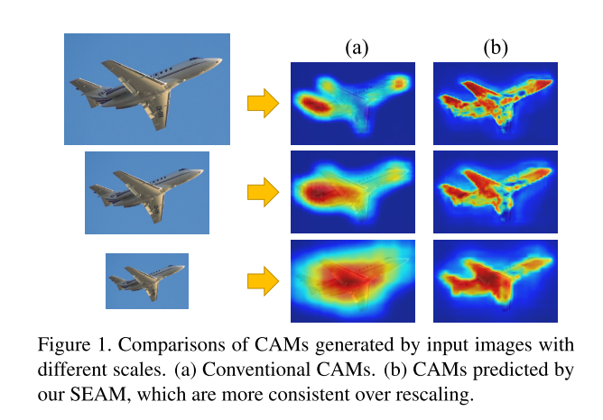
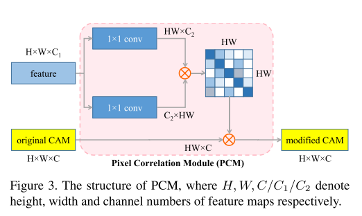
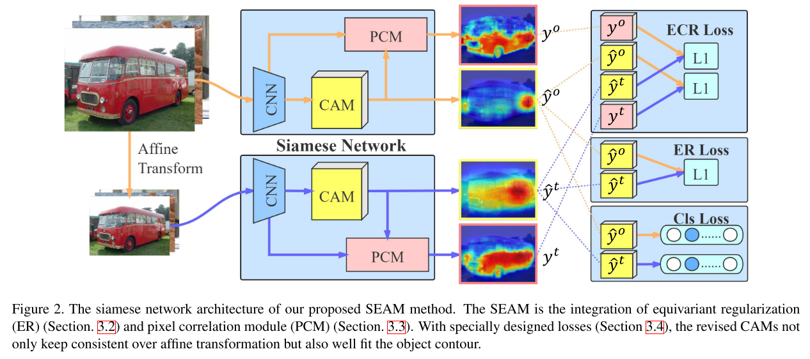
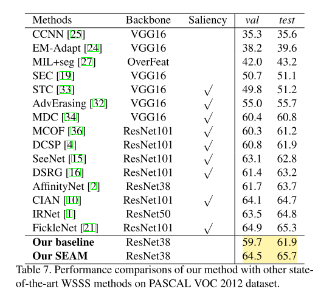

---

layout: post

title: 【论文阅读】【CVPR 2020】 Self-supervised Equivariant Attention Mechanism for Weakly Supervised Semantic Segmentation

date:  2020-05-31 09:00

tags: 

- 弱监督语义分割

- 论文阅读

author: Lixiang Ru

img: 2020-05-31-seam/cam_scale.png

permalink: /2020-05-31-seam

mathjax: true

---

这是CVPR 2020的一篇oral文章，内容是提出了 Self-supervised Equivariant Attention机制来进行弱监督语义分割。

## **Motivation**

本文的主要idea来源是对 分类网络的CAM 和 分割网络 的一个观察。一般来说，语义分割网络对输入图像是具有仿射不变性（例如放缩、旋转等）的。即，对一张图片，输入分割网络得到的结果再进行放缩 与 先放缩再进行分割的到的结果应该是类似的，然而对于分类网络的CAM，得到的结果往往差别很大，如图中（a）列的结果。



所以，作者就通过约束相同输入经过仿射变换得到的CAM与CAM进行仿射变换差异最小化，来得到更可靠的网络CAM结果，从而提高segmentation label的质量.

## **Equivariant Regularization**

论文首先提出了等边正则项Equivariant Regularization，来约束不同仿射变换的CAM之间相同。如下式所示

$$
R_{ER}=||F(A(I))-A(F(I))||_1
$$

其中的$F$ 表示网络的映射函数，$A$表示对图像进行仿射变换的操作，比如旋转，缩放，反转等，$I$表示输入的图像。通过Equivariant Regularization，模块，网络能够生成到更robust的CAM。

## **Pixel Correlation**

作者又设计了一个像素相关模块来对CAM的结果进行精细化处理。



如上图所示，CNN的特征分别经过两个分支的1*1卷积，再进行reshape得到两个形状的feature map，然后相乘得到映射矩阵；再对原始的CAM map进行转换得到细化的CAM。

## Loss Functions

论文的损失函数有几部分构成，首先是分类损失$L_{cls}(z,l)$：

$$L_{cls}(z,l)=-\frac{1}{C-1}\sum_{c=1}^{C-1}[l_clog(\frac{1}{1+exp(-z_c)})+(1-l_c)log(\frac{exp(-z_c)}{1+exp(-z_c)})]$$

这很明显是一个基于sigmoid二分类损失的多分类损失；

然后是Equivariant Regularization损失$L_{ER}$:

$$L_{ER}=||A(\hat y^o)-\hat y^t||_1$$

同时，作者说，在他们的早期实验中，PCM的输出map很容易落入局部最小值，倒是结果很差，随意又加了一个Equivariant  Cross Regularization损失$L_{ECR}$：

$$L_{ECR}=||A(y^o)-\hat y^t||_1+||A(\hat y^o)-y^t||_1$$

网络总的损失函数就是这三个损失的和。总体的网络结构如下图所示：



## **Experiments**

论文的代码作者已经在[github](https://github.com/YudeWang/SEAM)上发布，按照作者给的README，代码很容易work，~~但是按照流程走下来，结果好像不太行~~。论文的结果显示在PASCAL VOC上的验证集上mIoU为64.5，如下图



~~我重新训练的结果mIoU只有59.99，用作者给的训练好的model结果只有59.62，，，是不是哪里不太对？~~  我复现的结果如下图所示，SEAM生成的mIOU结果是59.99，作者给的模型结果是59.62，后续的利用伪标签训练分割网络进行预测的实验没有开源代码。

``` shell

2020-05-31 17:19:46 my_val

background:86.1225370697138 aeroplane:63.98442943355891 bicycle:31.329856717149042 bird:72.44971594106644 boat:41.70726229536961 bottle:54.62641250613579 bus:73.52741610297034 car:69.90752230176145 cat:66.0755958255341 chair:30.28465860922575 cow:67.79054165136675 diningtable:49.133552076951844 dog:73.9419564776601 horse:69.66234711289516 motorbike:67.74660446244494 person:65.64774996315096 pottedplant:38.787968787453096 sheep:79.22168184655212 sofa:50.34023876891117 train:61.09394039562475 tvmonitor:46.45707379439012 mIoU:59.99233629237553 
=====================================

2020-05-31 17:20:01 given

background:85.79242530100177 aeroplane:62.14021567227535 bicycle:31.15835953669167 bird:70.4919869167779 boat:39.08911412399632 bottle:55.20281799445457 bus:70.5366701715942 car:69.43439022532422 cat:66.46602988818057 chair:30.100702515061695 cow:67.77883723664102 diningtable:49.40987705234941 dog:73.82521009619329 horse:69.6578167095114 motorbike:68.54495100127824 person:67.03515500128138 pottedplant:37.30152117868401 sheep:79.11641886133476 sofa:51.826779700710276 train:58.48604602364132 tvmonitor:48.50346381421109 mIoU:59.61422804862829 
=====================================

```

值得注意的是，同样的conda环境，在1080Ti服务器上的精度比TiTan Xp服务器要好，上面这个结果是在1080Ti服务器上获得的。令人迷思。

##  总结

这篇文章的基于的观察很有意思，~~但是我复现的结果差点，或许是我哪里步骤出问题了？~~  另外，PCM模块部分有些牵强，虽然ablation实验部分显示PCM的效果很好。