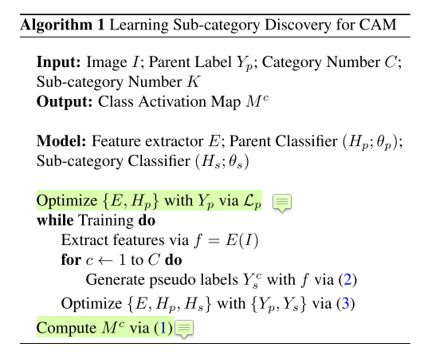

---

layout: post

title: 【论文阅读】【CVPR 2020】 Weakly-Supervised Semantic Segmentation via Sub-category Exploration

date:  2020-06-03 09:00

tags: 

- 弱监督语义分割

- 论文阅读

author: Lixiang Ru

img: 2020-06-03-sc_cam/sc_cam.png

permalink: /2020-06-03-sc_cam

mathjax: true

---

CVPR 2020上的一篇关于弱监督语义分割的文章。通过再训练分类网络的时候融合子类信息来提高生成的CAM的质量，从而提高伪标签的精度，以及弱监督语义分割的准确率。

## Background

多阶段的弱监督语义分割一般分为三个处理步骤：1）训练分类网络，生成初始的类别激活图；2）用CRF之类的方法对初始的激活图进行细化得到质量更高的伪标签；3）用伪标签训练分割网络，得到语义分割的结果。由于原始的类别激活图是由分类得到的，大多只关注图像最具判别性的部分，有很明显的缺陷，所以很多方法都是在步骤1做文章。

## Method

为了解决这个问题，作者认为，得到初始类别激活图时采用的是分类网络，只用分类损失是不可避免出现这种情况的，所以要加入辅助的措施来改善这个情况。

### Overview

在获取原始的激活图时，作者使用的baseline是经典的CAM。为了解决CAM只关注图像中最判别性的部分，作者提出了自监督的子类发现策略，来强制网络学习更多的物体区域。

首先，对于每个标注的类别（例如VOC数据集的人、车等），通过kmeans聚类设置K个子类；对于聚类的结果，每个子类分配一个伪标签；从而也就建立了一个子类的目标函数来协助训练分类网络。通过迭代的更新特征提取器，分类器和子类的伪标签，提高的特征表达能得到更好的分类结果，并提升response map的质量总体的流程如下图所示

论文采取CAM作为initial response，给定一个输入图像 $I$ ，对应的多类标签为$$Y_p$$。网络训练之后，对应类别$c$的激活图可以通过直接对feature map进行操作：

$$M^c(x,y)=\theta^{c^T}_p f(x,y)$$

其中的$\theta^{c}_p$是分类器对类别$c$的权重，$f(x,y)$是x，y的特征。$M^c$还需要除以最大值进行标准化。

###  Sub-category Exploration

由于上面的CAM的损失函数还是基于分类损失的，所以还是老问题，只关注图像最判别性的部分。为了解决这个问题，论文整合了一个自监督的模块来提升特征表达。也就是通过无监督的形式来发现子类类别提升CAM的效果。

对于每一个父类$p_c$，定义$K$个子类$s_c^k$，$c$是父类类别，$k$是子类类别。对于每一个图像$I$，父类的标签为$Y_p^c$，对应的子类标签为$Y_s^{c,k}$，另外如果父类的标签不存在，对应的子类标签也不存在。论文的目标是学习一个子类分类器$H_s$，参数是$\theta_s$，同时子类分类器和父类分类器$H_p$的权重是共享的。

因为没有子类标签的ground-truth，所以需要进行伪标签的生成。具体来说，是对父类的图像特征进行聚类，聚类的目标函数是

$$min_{D\in R^{d\times k}}\frac{1}{N}\sum_{i=1}^{N^c}min_{Y_s^c}||f-TY^c_s||^2_2,       s.t. {Y^c_s}^T1_k=1$$

其中$T$是一个$D\times K$的聚类中心矩阵，$N^c$是类别c的图像数量，$f=E(I)\in R^D$是提取的图像特征。$Y_s^c$是对应的子类伪标签。

获取子类伪标签之后，就可以对父类分类问题和子类分类问题进行联合优化，损失函数就是：

$$min_{\theta_p, \theta_s}\frac{1}{N}\sum_{i=1}^N\mathcal{L}_p(H_p(f_i),Y_p)+\lambda\mathcal{L}_s(H_s(f_i),Y_s)$$

其中$N$是图像的数量，$\lambda$是两个loss的权重。

网络的优化过程如上图所示，开始是先对父类分类器进行单独优化，才能生成聚类的伪标签。

### Details

论文的实现细节。代码在[Github](https://github.com/Juliachang/SC-CAM)上有,但是现在还是个空的repo。论文的分类网络的backbone是resnet38，数据集用的是PASCAL VOC 2012，在单张Titan XP上进行的实验（会不会很耗时？），参数$\lambda,K$分别设置的是5和10。获取CAM之后，采用AffinityNet的过程进行细化。

在分割阶段采用了DeepLab-V2作为分割网络，backbone在这一步采用的是resnet-101

## Experiment

根据论文的方法，生成的CAM相比较于原始的CAM对比如下，可以看到，大概有3%的提升。另外，AffinityNet中的Random Walk对CAM有很大的提升。

作者对各个类别的子类进行了展示，可以看到，每个类别的子类都是具有相同的背景或者目标形态的。

在VOC 2012的验证和测试集上的结果如下图所示。验证集的mIoU分别是66.1和65.9，比CVPR2020上SEAM的结果略高，比AAAI上RRM的结果略低。

## Conclusion

对这篇文章的认识就是对原本的父类进行了进一步分细化，相当于进行了一个细粒度的分类，本来是关注图像中最判别性的部分，现在分类标准变高，判别性的区域得到的增长，从而得到了更细致全面的CAM。