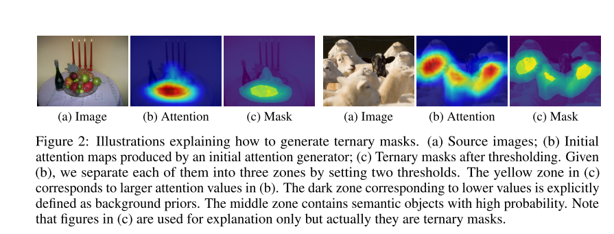
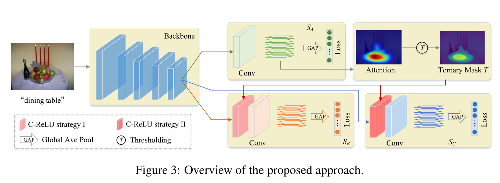
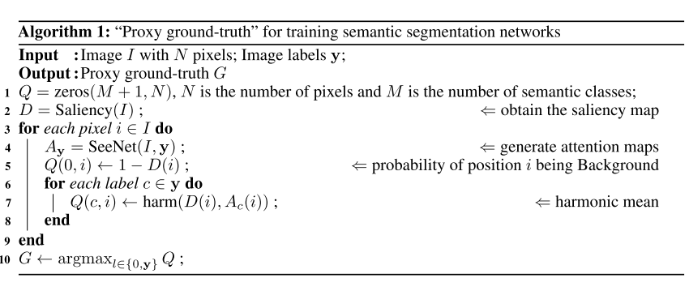
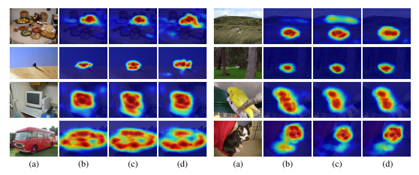
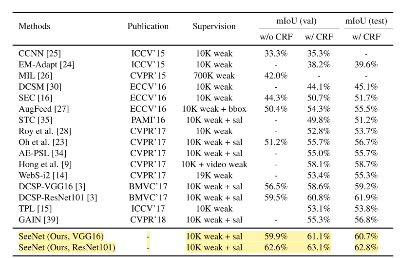

---

layout: post

title: 【论文阅读】【NIPS 2018】 Self-erasing network for integral object attention

date:  2020-06-20 12:00

tags: 

- 弱监督语义分割

- 论文阅读

author: Lixiang Ru

img: 2020-06-20-seenet/seenet.png

permalink: /2020-06-20-seenet

mathjax: true

---

NIPS 2018 一篇弱监督语义分割的文章，主要思想是利用自擦除策略（Self-erasing）来生成类别激活图，使其能更好的覆盖前景区域，避免背景区域；进而提高弱监督语义分割的精度。

## 背景

在弱监督语义分割中，怎么产生更好的类别注意力图是很重要的。作者提到，对小物体，CAM可以有很好的表现；但是对于大尺寸的物体，CAM经常值关注物体更具有判别性的部分，这对训练分类网络来说是不利的。

作者提出，不同图像的背景区域是有一定相似性的，这就可以促使我们给网络输入一个背景先验，来辅助CAM生成过程。

## 对抗擦除策略

在文献[1]里面，有作者提出了一个对抗擦除策略。大致过程是利用CAM产生初始的注意力图，利用阈值方法选择最属于object的区域进行擦除；然后把擦除过的图像输入到另一个CNN中进行训练，从而发现更多具有判别性的区域（也就是整个物体）。[2] [3]里面，对抗擦除策略又被设计成端到端的。

## 论文方法

作者注意到，在进行迭代的过程中，对抗擦除策略越来越倾向于定位不属于目标物体的部分。因此，很难确定什么时候终止训练。这篇论文显式的告诉网络那里是背景部分，所以可以让注意力网络更好的发现真正的物体区域。

### 背景先验

考虑到是弱监督的情况，获取准确的背景区域是很难的，所以论文退而求其次，选择获得想对比较准确的背景部分作为背景先验。

对于初始的类别激活图$M_A$ ，之前的对抗擦除策略是用一个阈值把它分割成背景/前景两部分；本论文是用两个阈值$\delta_h,\delta_l, \delta_h>\delta_l$,分成 背景/前景/不确定 三部分。具体取值：

$$
T_{A(i,j)}=0, if\ \ T_{A(i,j)}>\delta_h;\\
T_{A(i,j)}=-1, if\ \ T_{A(i,j)}<\delta_l;\\
T_{A(i,j)}=1, otherwise;
$$

也就是把背景区域的值置为-1，前景置为0，不确定置为1.

### 条件ReLU

根据背景先验，论文设计了一个条件ReLU单元（C-ReLu）。C-ReLu的输入是二值mask，定义为：

$$
C-ReLu(x)=max(x,0)\times B(x)
$$

其中B就是二值mask，值为{-1，1}，C-ReLu的作用是反转给定的mask的某些单元的值。

### 自擦除网络

论文提出的自擦除网络结构如下图所示：

网络的关键部分是图中的$S_A,S_B,S_C$三个模块。$S_A$的作用是产生原始的类别激活图$M_A$，然后通过阈值方法生成三元组mask $T_A$。

在分支$S_B$中，首先将$T_A$进行二值化，方法是把非负的值设为1，也就是把mask中的不确定和前景区域都置为1，背景置为-1，然后乘以feature map，也就是下面这个式子。

$$C-ReLU(x)=max(x)\times T_A(x)$$

相乘之后，前景和未确定部分乘的是1，背景部分乘得是-1，这样，在训练的过程中，就可以保证擦除了背景区域；同时由于前景和未确定部分都是1，可以帮助区分两者。

在分支$S_C$中，同样需要将$T_A$进行二值化，做法是将背景区域设置为1，前景和未确定区域设置为0；这样，只有背景区域的激活值为非负。在训练过程中，我们让背景区域 属于所有语义类别的概率都为0，这样就可以帮助准确的预测背景区域。

网络的损失函数，是这三个分支的分类损失函数之和：

$$\mathcal{L}=\mathcal{L}_{S_A}+\mathcal{L}_{S_B}+\mathcal{L}_{S_C}$$

$S_C$的分类标签是一个全0向量，$S_A$和$S_B$的分类标签是图像的真实标签。

网络训练完成之后，获得伪标签的方法如下图所示

这里用到了训练好的显著性检测的模型来生成显著性图来决定那些部分为背景；背景部分的概率值直接取自显著性检测的结果；前景部分的概率值是SeeNet的结果与显著性检测结果的调和平均。

## 实验

在实验部分，数据集还是PASCAL VOC 2012。对于attention部分的网络，采用VGG作为基干网络，$\delta_h,\delta_l$分别设置成0.7和0.05；对于分割网络，采用的是标准的Deeplab-LargeFOV结果，基干网络分别用了VGG16和ResNet101.

论文提出的SeeNet效果如下图所示：

（a）是原图，（b），（c），（d）分别是SeeNet和其他两篇文章的结果。数值结果上，SeeNet生成的结果在验证集上的mIoU是57.3，其他两个结果分别是56.1和55.8.

经过分割网络的处理之后的结果对比如下：

验证集和测试集上的结果分别是63.1和62.8，算是比较高的结果。

## 参考文献

[1] Yunchao Wei, Jiashi Feng, Xiaodan Liang, Ming-Ming Cheng, Yao Zhao, and Shuicheng Yan. Object region mining with adversarial erasing: A simple classification to semantic segmentation approach. In CVPR, 2017.

[2] Kunpeng Li, Ziyan Wu, Kuan-Chuan Peng, Jan Ernst, and Yun Fu. Tell me where to look: Guided attention inference network. In CVPR, 2018

[3] Xiaolin Zhang, Yunchao Wei, Jiashi Feng, Yi Yang, and Thomas Huang. Adversarial complementary learning for weakly supervised object localization. In CVPR, 2018.

